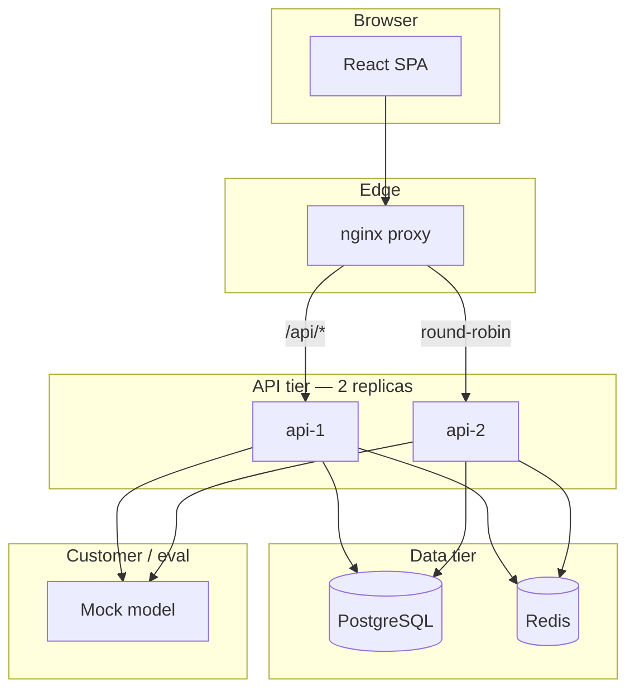
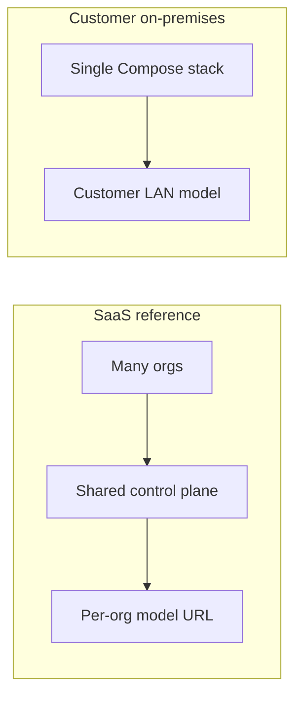
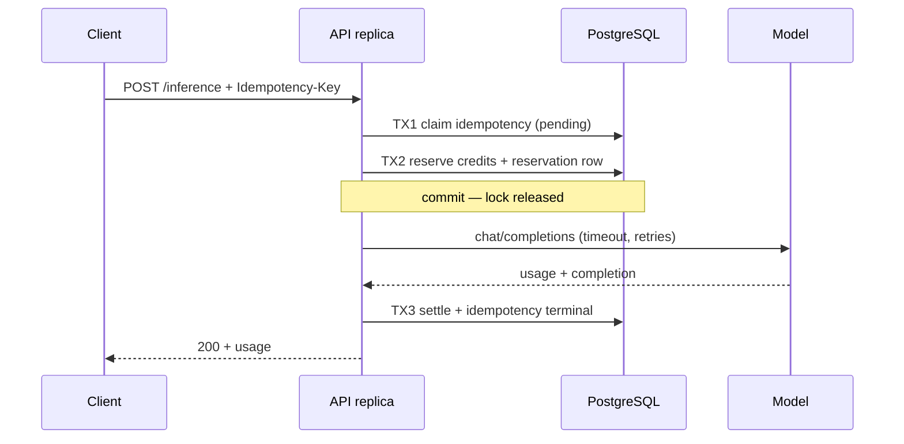

# Architecture

CraftifAI is a multi-tenant AI control plane: organizations manage teams, prepaid credits,
and a customer-provisioned model endpoint; members run inference through a gateway that
reserves credits, calls the model, and settles usage.

This document is written for someone who will interrogate the design under concurrency,
failure, and scale — not as a feature list.

---

## Components

| Component | Role |
|-----------|------|
| **React SPA** | Admin + member UI; static assets baked into nginx image |
| **nginx** | TLS termination (optional), `/api/` load balance, SPA fallback |
| **API (×2)** | Auth, credits, inference, billing webhook, model config, sweeper |
| **PostgreSQL** | Authoritative state: users, sessions, balances, ledger, reservations, idempotency |
| **Redis** | Session cache, revocation tombstones, rate limits — not authoritative |
| **Mock model** | OpenAI-compatible eval endpoint with injectable failures |

Monorepo layout: `apps/api`, `apps/web`, `packages/db` (migrations + DAL), `packages/shared`.

---

## SaaS vs on-premises

| Aspect | SaaS | On-premises |
|--------|------|-------------|
| Tenancy | Many orgs, shared DB | Typically one customer; same code path |
| Model egress | `ALLOWED_PRIVATE_CIDRS` empty — block RFC1918 | Default allows private ranges for LAN model |
| Secrets | Env / mounted files | Customer-managed mounts |
| Offline | N/A for prod SaaS | `docker-compose.offline.yml` — internal network only |
| Scaling | Horizontal API replicas; shared PG/Redis | Same pattern; customer sizes hardware |

The **same binary and schema** serve both; deployment profile differs by configuration only.

---

## Inference data flow

One request, three database transactions, model call outside any transaction:

**Failure path:** model error → release reservation in a transaction → idempotency `failed` with stored body → credits returned.

**Sweeper path:** reservation past `expires_at` → conditional `expired` transition → same release accounting as manual release.

---

## Consistency model

| Concern | Model | Mechanism |
|---------|-------|-----------|
| Credit balance | **Strong per org** | Single row lock on `org_credit_accounts`; guarded UPDATE |
| Idempotency | **Strong per (org, endpoint, key)** | PK + ON CONFLICT; terminal replay |
| Webhook credit | **At-most-once apply** | `webhook_events.provider_event_id` PK |
| Sessions | **Authoritative in PG** | Redis cache; 60 s max stale after revoke |
| Rate limits | **Eventually consistent** | Redis counters; acceptable for abuse prevention |
| Sweeper | **Correct without lock** | Conditional updates; advisory lock is efficiency only |

Isolation level: **READ COMMITTED** throughout. Stronger isolation is unnecessary because every invariant is a single-statement guard, unique constraint, or explicit row lock.

---

## Failure handling

| Failure | Behavior |
|---------|----------|
| Insufficient credits | 402 before model contact; idempotency terminal stores 402 |
| Model timeout / 5xx / 429 / malformed | Release reservation; no net charge |
| Process kill mid-request | Reservation expires; sweeper refunds |
| Duplicate idempotency key | Replay or 409 in-progress |
| Duplicate webhook | Second insert on PK fails; balance unchanged |
| Redis unavailable | Session cache miss → PG read; rate limit may fail open to 503 |
| Postgres unavailable | `/ready` 503; no partial credit writes |
| Model down | Inference fails; **admin/billing APIs stay up** — model excluded from readiness |

---

## Background reconciliation

Each API replica runs a 30 s interval sweeper:

1. `pg_try_advisory_lock(1)` — non-blocking; only one replica sweeps at a time.
2. Expired `reserved` reservations → `expired` + ledger release.
3. Stale pending idempotency keys → release linked reservation + mark failed.

The advisory lock is an optimization. Conditional `WHERE status = 'reserved'` makes double-refund structurally impossible even if two sweepers ran.

---

## Scaling to one million users

Numbers from the brief: ~1M users, 50K orgs, 100K DAU, 20K concurrent sessions, 1K rps control-plane, 300 rps inference peaks.

### First bottleneck: org-row lock on reserve

At **~300 inference rps** against **one hot organization**, reserves serialize on
`org_credit_accounts`. Each reserve holds the row lock for ~1–3 ms (three statements).
Rough capacity: ~300–1000 reserves/s per org before queuing dominates p95.

**Next move:** shard hot orgs (separate credit sub-accounts per workspace) or queue inference per org with strict concurrency — both require product/schema change. For typical spread across 50K orgs, mean traffic per org is low and this rarely bites.

### Second bottleneck: PostgreSQL connection pool

Load test (200 workers, 2 replicas): peak **41 backends**, Postgres CPU **57%** on 2 vCPU CI — not saturated.

**Next move:** Raise pool `max` per replica when `numbackends` approaches `max_connections × 0.7`. Size pool as `(replicas × pool_max) + admin + sweeper < PG max_connections`.

### Third bottleneck: ledger and audit growth

At 300 rps inference, **~26M reservation rows/day** if every request creates one row.
`credit_ledger` and `audit_events` grow similarly.

**Next move:** Monthly RANGE partitions on `created_at` (PKs are UUIDs — partition key not in PK). Archive cold partitions to object storage; retain aggregates for billing disputes.

### When one PostgreSQL stops being enough

**Signal:** sustained `pg_stat_database.blks_hit` collapse, replication lag on read replicas
(if added), or **vacuum / autovacuum cannot keep up** on `credit_ledger` at >~50M rows/day
with hot indexes.

**How you know:** p95 reserve latency rises while CPU is moderate (IO wait), or checkpoint
 spikes correlate with inference peaks.

**Move:** Primary + synchronous standby for HA; async read replicas for member/audit lists
only — **never** for balance writes. Credit correctness stays on the primary.

Rough order-of-magnitude: single well-tuned PG 17 instance with NVMe handles **low thousands
of write TPS** on narrow rows; this design's write path is ~3–4 statements per inference →
practical ceiling ~500–800 inference rps **cluster-wide** before PG becomes the limiter
(hardware dependent).

### SaaS vs on-prem scaling

| | SaaS | On-prem |
|---|------|---------|
| API | Autoscale replicas behind LB | Customer adds CPU/RAM; second API container |
| PG | Managed HA, read replicas for lists | Customer Postgres HA (Patroni, etc.) |
| Redis | Cluster for rate limits | Single Redis acceptable at customer scale |
| Model | Customer endpoints vary | Usually one LAN endpoint — lower SSRF policy surface |

### Multi-region without corrupting balances

**Honest answer:** org credit state is **single-primary**. Multi-region active-active on
the same org balance will corrupt without distributed consensus.

**Approach:**

1. **Org pinned to a home region** — all credit writes route to that region's primary PG.
2. **Global LB** sends inference to home region (org_id in token or resolved from session).
3. **Cross-region reads** (audit, usage history) from async replica with "may lag" UX.
4. **Failover** — promote standby in DR region; accept RPO = replication lag (seconds);
   no split-brain writes during failover (fence old primary).

Active-active multi-region for **the same org balance** would require CRDTs or a distributed
transaction log — out of scope and wrong tool for prepaid integer credits.

---

## Deliberate non-goals in this slice

- Streaming inference (bonus; same state machine, transport change only)
- Kubernetes packaging (Compose is the deliverable)
- Real payment provider
- Email delivery for invitations

See `docs/decisions/` for accepted alternatives on isolation, balance, and idempotency.
